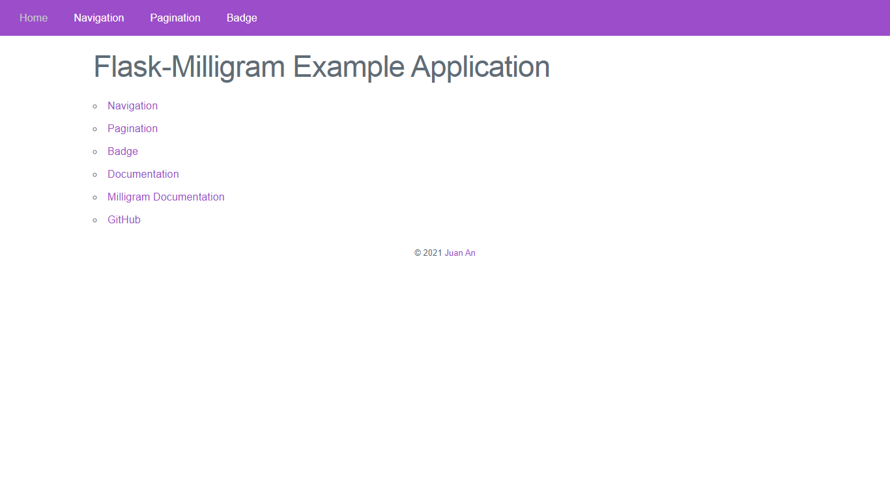

# Flask-Milligram

[Milligram](https://milligram.io/) — a minimalist CSS framework — helper for Jinja2 template engine in Flask.

## Links

-   [Documentation](https://flask-milligram.readthedocs.io/)
-   [Example Application](https://github.com/ImJuanan/flask-milligram/tree/master/examples)
-   [PyPI Releases](https://pypi.org/project/Flask-Milligram/)

## Example

See [here](https://flask-milligram.readthedocs.io/en/latest/examples.html) to run the example application.

## License

This project is licensed under the MIT License (see the
`LICENSE` file for details).
